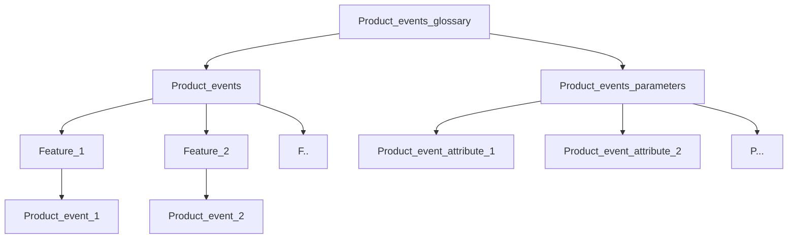

# Product events glossary

---
tags: [glossary, metadata, governance, productevents, swrveevents]

owner: Data Governance team

status: Draft

---

## What is the Product events glossary

The Product events glossary is a standard hierarchical dictionary that contains list of product events from Swerve with definitions, attributes,relationships with BI metrics and relevance to corresponding user flow part of application and to certain application feature. Glossary is realized in [OpenMetadata](https://prod.metadata.indrive.tech/glossary) (OM).

Its purpose is to solve problems identified by Product analysts as follows:

* Problem: need convenient list of all product events  
Solution: product events Glossary represet single source of knowledge of all product events in our company, provides convenient search
* Problem: need ownership of product events is assigned and this is visible  
Solution: product events ownership is fixed for each event and parameter in Glossary, is visible on corresponding pages  
* Problem: need visualized events within app user flow with defined service team  
Solution: depict events in relation to application user flow, feature, verticals' teams. Allowed filtering using tags, with possibility to incert screen shots of correposning app part.  

## Product events glossary structure

All events should be created according to the following hierarhical parent-child structure. Relationship in this structure is 1 to 1, meaning that 1 child corresponds to 1 parent:

Overall Glossary functions are described in separate instructinon [Glossary ownership policy](https://dev.indriver.io/docs/data-guidebook/main/tutorials/data-stewardship/register-glossary-owner).

Product events glossary structure objects:

* Domain - is the activity of an organization or its independent part, which has a set of unique properties and described through a set of structured and unified data about it.  
There are two of them in this glossary: Product events and Product events parameters.
Domain is added by Steward as the creation of Glossary and not changed by Glossary owner (products analyst/product manager). 

* Feature - specific component or element of application that needs to be analyzed via swerve product event.  
Example: Event feature CPF check  
Name convention: Firts word with upper case letter, spaces are acceptable.
Feature is added by Steward initially and can be added new by Glossary owner (products analyst/product manager).  

* Product event - user events and properties that are sent from mobile apps and backend as a result of user activity. They are created in Glossary by product analysts/product managers and have parts described in details below. In addition they show relation to certain BI metric if tagged separately by BI team in BI metric glossary.  
Example: call.client.call_incoming_accept.click

* Events parameters - attributes of swrve events like order_id, city_id enabling proper analysis of certain app feature.

[Classification](https://prod.metadata.indrive.tech/tags/Glossary%20types) in OpenMetadata section contain:

* Glossary types contain: "Events", "Events_parameters", "Events_Feature"
* Events teams contain: Verticals' teams "Events_TnS", "Events_Messenger", "Events_Geo", "Events_Watchdocs" added at initial Glossary usage stage and other will be added at full Glossary usage stage
* User flow group contain: "Events_name of user flow group".

These classification types are used to tag corresponding event for better filtering and search.

## Ho to create and use tags

* How to access and use tags:

Go to [Classification](https://prod.metadata.indrive.tech/tags/Glossary%20types) and find tags groups relevant for Product events glossary, they are as described above.

When creating product event term, add relevant tags from all groups as described above to the field "Tags".

* How to Cerate additional tags:

If available tags are not enough, ask Data Steward from [Data Governance team](https://teammate.indriver.io/subdivision/data-governance-team_63b6ada125cb876004f46037) to create additional tags and provide reasons for that.

## How to create a new product event term

It is possible to create a new term in Glossary manually in the OpenMetadata UI or via Bulk Import (csv-file).

### The process of Product event creation manually in the OpenMetadata UI

As prerequisite for this process, Product analyst/Product manager performs the following:

* Set up [vpn](https://docs.google.com/document/d/1TFDSIxGgS3W-WILUdnK5cOiBll8-b5mIpmTlVdJEkqQ/edit?pli=1)
* Always turn on inDrive_VPN when connect to <https://prod.metadata.indrive.tech/glossary>
* Sign into OpenMetadat using Single Sign-on (SSO) using InDriver employee Google account
* ask Data Steward from [Data Governance team](https://teammate.indriver.io/subdivision/data-governance-team_63b6ada125cb876004f46037) to provide "Glossary owner" role. For additional information see Glossary ownership policy [here](https://dev.indriver.io/docs/data-guidebook/main/tutorials/data-stewardship/register-glossary-owner).

After that the process is as follows:

1. Structure element creation  

Role: Glossary owner (products analyst/product manager) 
Action:   
Go to Glossary in OpenMetadata and either create new Feature by pressing "add term" in the upper right corner if existing Features are not enough, or choose proper existing Feature for adding product event term there.

2. Product event term creation (or new parameter creation)  

Role: Glossary owner (products analyst/product manager)  
Action: Create new product event term/parameter (thus becomes owner of it):  

Search if this event term or parameter already exists using name. Similar names are not allowed.  

After choosing relevant Feature, push "+" sign next to it: 

Fill-in pop-up window with term card:

  *  Name and Display name: should be the same, use lower case text naming and the same style as it will be added to code by developer, words separated by dots or undescore. For example term: call.client.call_outgoing_screen.view. Parameter example: country_code.

  * Description: should contain text explaining the nature and meaning of product event term/parameter. Add .png format screen shot of corresponding user flow to product event term (no need for parameter) by ctrl-c the screen shot on your computer and ctrl-v it to description. You can use markdown syntax to divide it from text description.

  * Tags: 
    * for product event term: add tags "Events", "Events Feature" (of the Feature group that the event term corresponds to), one from "Events user flow" and one from "Events teams" 
    * for parameter: add tag "Event parameters"

  * Synonymus: not used

  * Related terms:
    * for product event term: link here all corresponding parameters from Product events parameters domain 
    * for parameter term: link it to corresponding product event term from Product events domain

  * Icon URL: not used

  * Add reviewer as described below

All the steps above are mandatory.

Press Save in the end of the term card.  
Term status/parameter status (in OM version 1.2): Draft

3. Review assignment

Role: Glossary owner (products analyst/product manager)  
Action: 
To performs review aimed to check if all the aspects of product event term established and filled-in properly:
* For product event term: add reviewer to the Feature in the corresponding field in the right side of the screen. Reviewer should be one of four Product team leads according to [Teammate](https://teammate.indriver.io/subdivision/data-analysis-department_63b659c725cb876004f4529d). The same Reviewer will be added automatically to the Product event term in this Feature group. More reviewers can be added manually if needed.

* For product event parameter: add reviewer to the parameter in the corresponding field in the right side of the screen. Reviewer should be one of four Product team leads according to [Teammate](https://teammate.indriver.io/subdivision/data-analysis-department_63b659c725cb876004f4529d)

This step is mandatory.

Term status/parameter status (in OM version 1.2): Draft

4. Review performed

Role: Product team lead 
Action:  
What aspects does reviewer check:
* completion of all mandatory fields: name, descriprion, related terms, tags 
* quality of description
* tag are added properly
* no duplicate events
* events and parameters ate properly added to the structure of glossary 

Reviewer determines if corrections are needed and writes what is needed to be corrected. If corrections are not needed - approves it.  

This step is mandatory.

Term status (starting from OM version 1.2): If not approved = Draft, If approved = Approved

4. Developer task link  

Role: Product analyst/Product manager  
Action:  
Create Jira task for IOS/Android developers to create this product event in app/new parameter.  
After that open corresponding product term card and link Jira task for developers into "References" field of Product event term in Glossary.  

This step is mandatory.

Term status (starting from OM version 1.2): Approved

### Bulk import

In case if Bulk Import is needed please contact Data Steward in Data Governance (DG) team, and follow the process:

1. product analysts agree with DG on a suitable loading template (use #metadata-platform channel in Slack or  create task in в DAT project in Jira)
2. product analysts fill-in the template with relevant metadata
3. DG team check the test load of template into OM
4. DG team organize the final loading,
5. product analysts check the result

## Product event term structure

Each product event is located in "Product events" domain and has the following data granulation:

1. Name  

Text type mandatory field containing short name of event.

Source: Manual input.  
Naming convention of event: words with lower case letters divided by dot, same as they are denoted in the code by developers. Each part of name represents the following: vertical.usertype.screenname.screenelement.action

However, this is not a mandatory requirement to follow the name convention as above and should rather be used as recommended name structure. Typical deviation is when used either one of SceenName or ScreenElement, for example call.client.call_incoming_accept.click.

2. Description

Text type mandatory field containing description of event explaining its business essence and usage.  
Contains .pmg format screen shot showing corresonding user flow step in app.
Source: Manual input.  

3. Related Terms  

Mandatory field, contains reference from drop-down list to corresponding event parameters.  
Reference to BI metric if denoted in BI metric first.
Source: Manual input.  

4. Tags  

Mandatory field, contains reference from drop-down list to corresponding tags from Classification.
  
Example: Registration
Source: Manual input.

5. References  

Mandatory field, contsins Link to corresponding Jira task for IOS/Android developers to create this product event in app (for new events only).  
Source: Manual input.

6. Synonyms  

Not used in this Glossary.

7. Owner

Creator of event term with role "Glossary owner" assigned by Data Steward.  
Source: Manual input.

8. Reviewers

Mandatory field, contains assigned reviewer by owner manually at he stage of event term creation for reviewing and approving new event term.  
Source: Manual input.

9. Tab "Glossary Terms"

Usually it contains child entities of this term. In case with event and parameter term this tab will be empty because event is the lowest child in the hierarchy.  

10. Tab "Assets"

Other than Glossary entities referenced. In case with event term this tab will be empty because there is no case identified when would need to associate some other entity wity the event term.  

## Product events' parameters structure

Parameters are located in "Product events patameters" domain and named the same way as in dwh table "indriver-e6e40/product_platfrom/fct_swrve_events" which are sourced from Swrve.

1. Name  

Mandatory field, text type field containing short name of parameter.  
First upload is automatically, Source: indriver-e6e40/product_platfrom/fct_swrve_events.  
Each new is added manually.

2. Description

Mandatory field, text type field containing description of event explaining its business essence and usage.  
Source: Manual input.

3. Related Terms  

Mandatory field, reference from drop-down list to corresponding event parameters from domain "Swrve_events_patameters".
Source: Manual input.

4. Tags  

Will contain "Events parameters" tag

5. References  

Mandatory field, contsins Link to corresponding Jira task for IOS/Android developers to create this product event parameter in app (for new parameters only).  
Source: Manual input.

6. Synonyms  

Not used in this Glossary.

7. Owner

Mandatory field, for new parameters - creator of parameter with role "Glossary owner" assigned by Data Steward.  
Source: Manual input.

8. Reviewers

Mandatory field, assigned by owner manually at he stage of parameter creation for reviewing and approving new parameter.  
Source: Manual input.

9. Tab "Glossary Terms"

Usually it contains child entities of this term. In case with parameter this tab will be empty because parameter is the lowest child in the hierarchy.  

10. Tab "Assets"

Other than Glossary entities referenced. In case with parameter this tab will be empty because there is no case identified when would need to associate some other entity wity the parameter.